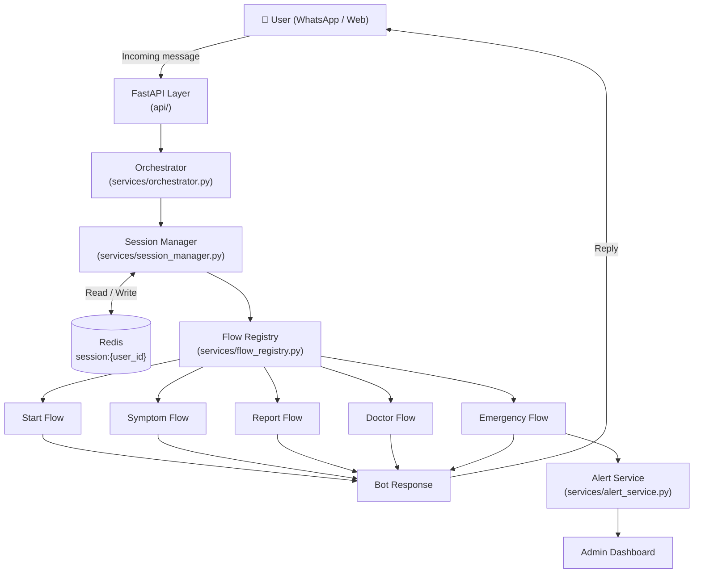
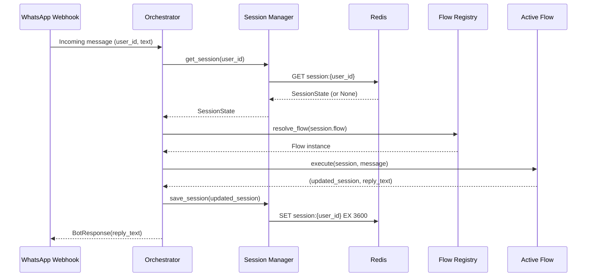
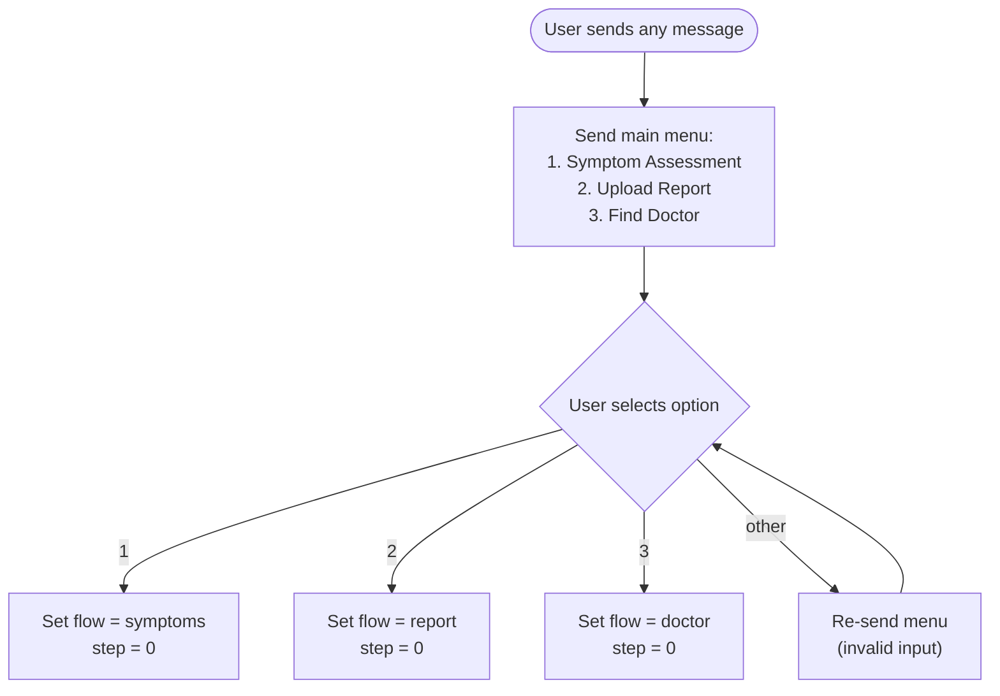
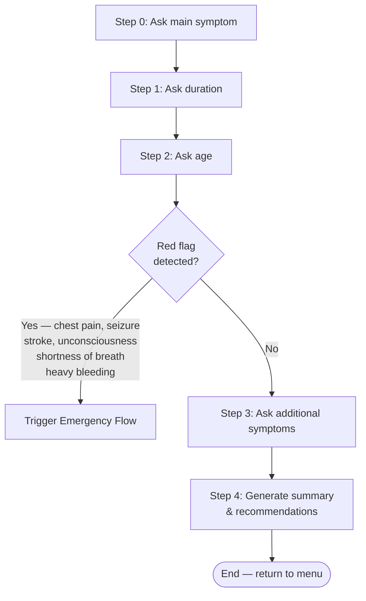
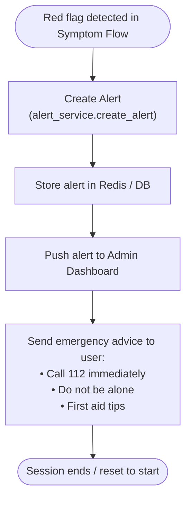
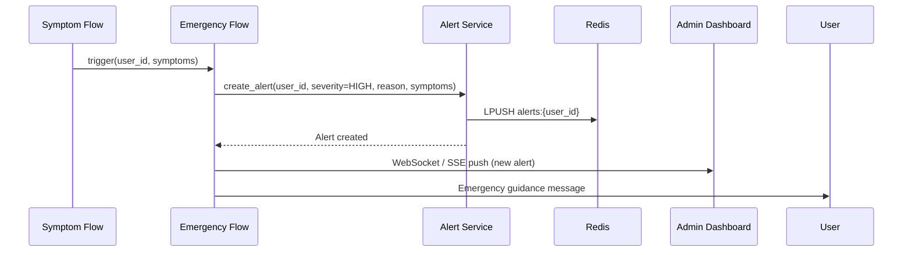
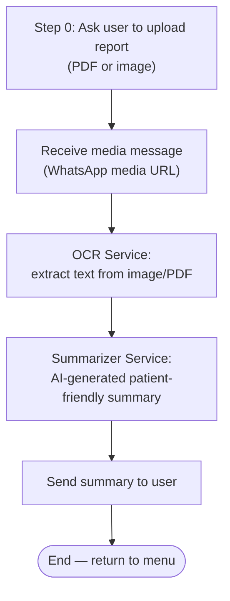
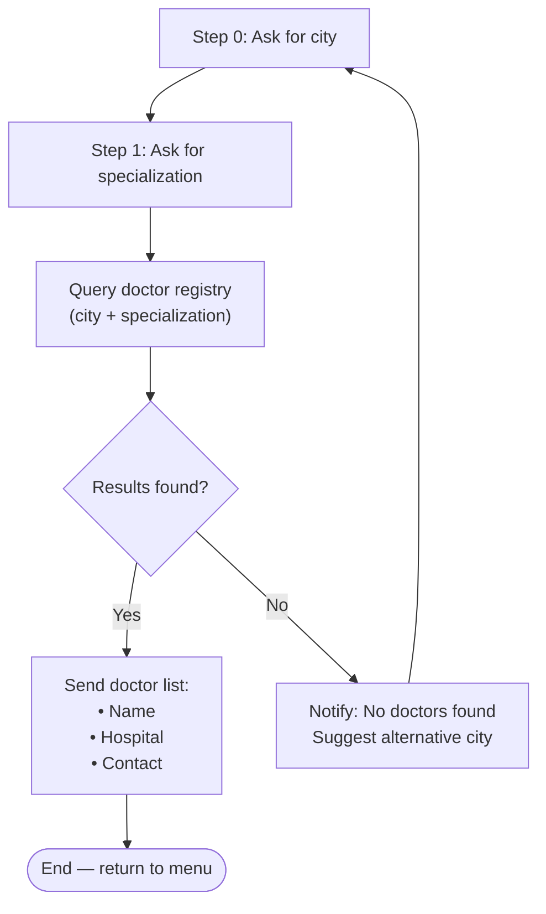
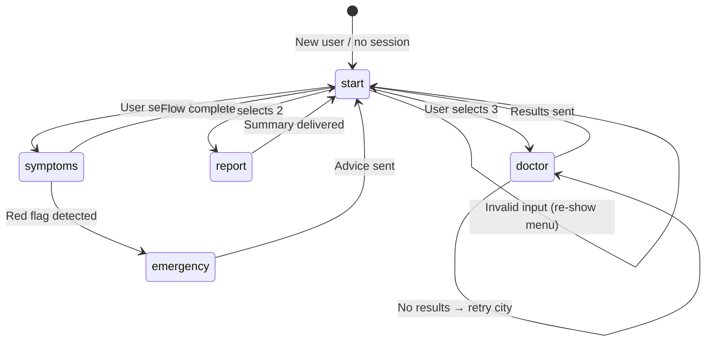
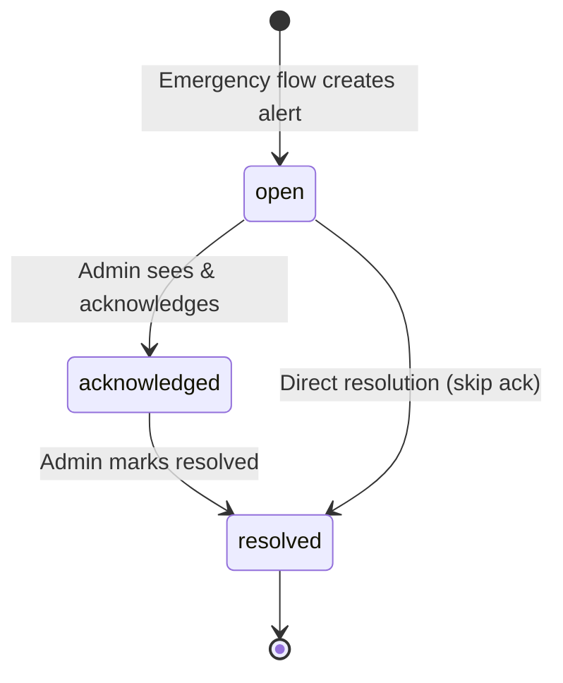

# MedVerify Flow Diagrams

---

## 1. High-Level System Architecture

---

## 2. Orchestrator Processing Pipeline

---

## 3. Start Flow

---

## 4. Symptom Flow

**Red Flag Keywords**

| Keyword | Severity |
|---------|----------|
| chest pain | HIGH |
| shortness of breath | HIGH |
| seizure | HIGH |
| unconsciousness | HIGH |
| heavy bleeding | HIGH |
| stroke symptoms | HIGH |

---

## 5. Emergency Flow

---

## 6. Report Flow

> **Note:** OCR and Summarizer services are planned as future AI modules. The flow is stubbed pending implementation.

---

## 7. Doctor Flow

---

## 8. Session State Machine

---

## 9. Alert Lifecycle

